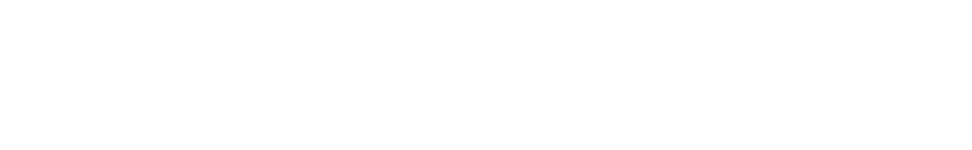

<div align='center'>
  
</div>
</br>
</br>

<h1 align="center">


</h1>

<div align='center'>
  
</div>
</br>
</br>


 ## 💻 Projeto
 
 Projeto faz parte do teste para a vaga de desenvolvedor front-end pleno da e-Get.
</br>


 ##  Tecnologias utilizadas para o desenvolvimento da aplicação

- [ViteJS](https://vitejs.dev/) ;
- [ReactJS](https://pt-br.reactjs.org/) ;
- [Typescript](https://www.typescriptlang.org/) ;
- [Styled Components](https://styled-components.com/) ;
- [Redux](https://redux.js.org/) ;
- [Redux Toolkit](https://redux-toolkit.js.org/)
- [Redux Persist](https://www.npmjs.com/package/redux-persist)
- [Axios](https://axios-http.com/docs/intro)
- [Immer](https://axios-http.com/docs/intro)
- [Zod](https://axios-http.com/docs/intro)
- [Eslint](https://eslint.org/)
- [Phosphor Icons](https://phosphoricons.com/) ;

</br>


## Para executar o projeto localmente:

Clone o projeto e acesse a pasta 
ecommerce

```bash
$ git clone https://github.com/the-one-who-knoccks/ecommerce

$ cd ecommerce

```
Para iniciá-lo, siga os passos abaixo:
```bash
# Instalar as dependências
$ npm install ou yarn install

# Iniciar o projeto
$ npm run server, ou yarn dev server para iniciar
o json server

Em outro terminal, execute npm run dev ou yarn dev para iniciar o projeto
```
A aplicação será iniciada no endereço http://localhost:3000.

<br/>


	